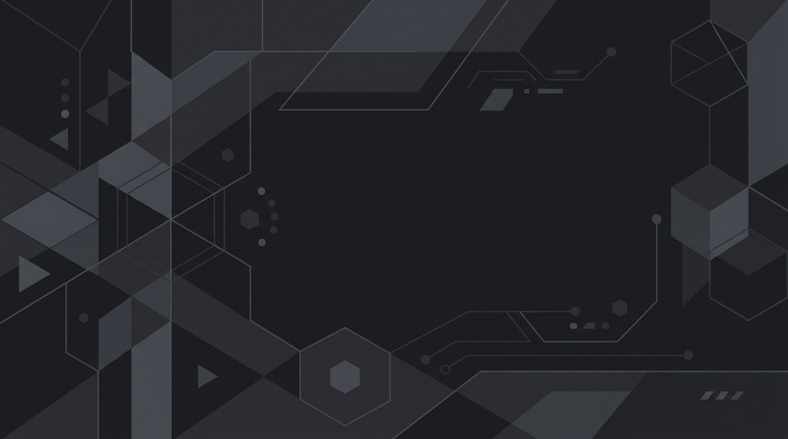



  

# 👋 Hi, I'm Iman Moradi Nezhad

### Cloud & AI Engineer

Welcome to my portfolio! I build cloud infrastructure, automate complex processes, and deploy AI models so that businesses can run faster, safer, and more efficiently.

---

## 🌟 What I Do (In Plain English)

*   ☁️ **Cloud Infrastructure:** I build the "digital buildings" (servers, databases, networks) that websites and apps live in.
*   🤖 **Artificial Intelligence:** I deploy intelligent models that can analyze data and make predictions (like healthcare diagnostics and industrial voice recognition).
*   ⚙️ **Automation (DevOps):** I write scripts that do the boring, repetitive work automatically, saving teams hundreds of hours.

---

## 🛠️ My Tech Toolbox

  
  
  
  
  
  

  
  
  
  

---

## 🚀 Featured Projects

### 1. 🏭 [Industrial AI Voice Assistant (Stellantis Project)](https://github.com/ImanMrd/Voice-based-AI-application)
*   **The Problem:** Factory electricians were wasting ~5 minutes per task typing defect data into web forms manually.
*   **My Solution:** Developed a secure, hands-free Voice AI (Whisper & Claude) that instantly transcribes and organizes defect data into corporate databases.
*   **Business Value:** Slashed data entry time to ~1 minute per defect, increasing factory floor efficiency and data accuracy.

### 2. 🏥 [AI Healthcare Diagnostic Tool (Lung Cancer Classifier)](https://github.com/ImanMrd/Lung-Cancer-classifier)
*   **The Problem:** Doctors need fast, accurate tools to help diagnose patient data.
*   **My Solution:** Built and deployed an AI model that analyzes health indicators to predict lung cancer risk.
*   **Business Value:** Speeds up the initial screening process, allowing healthcare professionals to focus on critical patient care.

### 3. ⚽ [Live Sports Data Engine (Football API)](https://github.com/ImanMrd/Football-Data-Management-API-FastAPI-)
*   **The Problem:** Sports applications need real-time, organized data to show scores and statistics to users.
*   **My Solution:** Created a high-speed data pipeline (API) that fetches, organizes, and delivers live football data securely.
*   **Business Value:** Demonstrates how to handle large streams of live data reliably for web or mobile apps.

### 4. 🏗️ [Automated Cloud Builder (Terraform Infrastructure)](https://github.com/ImanMrd/Learning-Terraform)
*   **The Problem:** Setting up servers manually takes weeks and is prone to human error.
*   **My Solution:** Wrote "Infrastructure as Code" that builds complete, secure company networks in the cloud with a single click.
*   **Business Value:** Reduces setup time from days to minutes and ensures absolute security and consistency.

---

## 📫 Let's Connect!

> *"I bridge the gap between complex engineering and real-world business solutions."*
